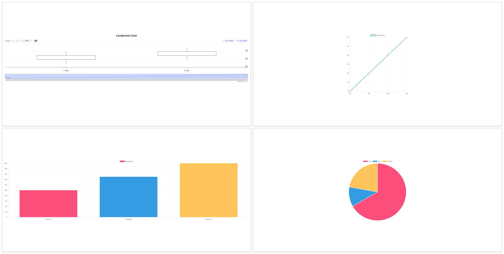

Time Taken : 7.5 hrs

The above dashboard might not be the most aesthetically pleasing one but I have tried my best to fulfill the basic criterias(and most of the bonus) while learning Django over the past few hours.

## Libraries and Tools Used

- **Frontend:** Next.js, Tailwind CSS
- **Backend:** Django, Django REST Framework
- **State Management:** Redux
- **Data Visualization:** Chart.js
- **Containerization:** Docker, Docker Compose

---

## To Reproduce

1. **Clone the Repository:**
   ```bash
   git clone https://github.com/kxusx/dashboard.git
   cd <project-directory>
   docker-compose up --build
   ```

- Open your browser and navigate to http://localhost:3000 for the frontend.
- The backend should be accessible at http://localhost:8000.

### Local Development (Optional)

- Frontend: Navigate to the dashboard directory and run:
  ```bash
  npm install
  npm run dev
  ```
- Backend: Navigate to the mybackend directory and run:

    ```bash
    pip install -r requirements.txt
    python manage.py runserver
    ```

---

## Approach and Thought Process
### Setup:
Established a full-stack application with Next.js for the frontend and Django for the backend.
Utilized Docker for consistent environment setup and deployment.
### Frontend Design:
Implemented a responsive dashboard using Tailwind CSS.
Arranged charts in a 2x2 grid layout for a clean and organized appearance.
### Backend API:
Created RESTful API endpoints in Django to serve chart data.
### State Management:
Integrated Redux for efficient state management and data flow between components.
